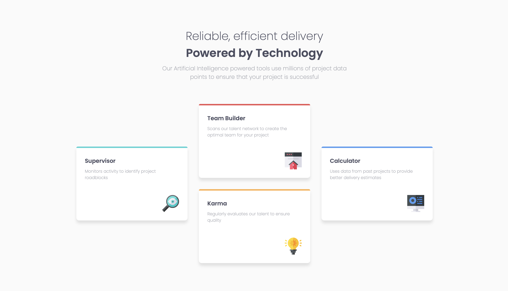
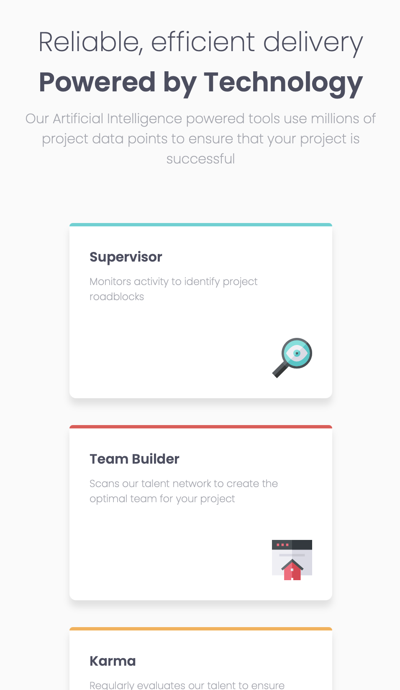

# Frontend Mentor - Four card feature section solution

This is a solution to the [Four card feature section challenge on Frontend Mentor](https://www.frontendmentor.io/challenges/four-card-feature-section-weK1eFYK). Frontend Mentor challenges help you improve your coding skills by building realistic projects.

## Table of contents

- [Overview](#overview)
  - [The challenge](#the-challenge)
  - [Screenshot](#screenshot)
  - [Links](#links)
- [My process](#my-process)
  - [Built with](#built-with)
  - [What I learned](#what-i-learned)
- [Author](#author)

## Overview

A responsive four card feature section built with CSS grid and flexbox

### The challenge

Users should be able to:

- View the optimal layout for the site depending on their device's screen size

### Screenshot

### Links

- Live Site URL: [View Project](https://your-live-site-url.com)

## My process

### Built with

- Semantic HTML5 markup
- CSS custom properties
- Flexbox
- CSS Grid

### What I learned

I am not too proud of the way this turned out, to be honest. I really dislike CSS grid; however, I am slowly getting more comfortable with it. At least the end product is fully functional and close to the design, even if I am not happy with it.

## Author

- Website - [Carson Haskell](https://portfolio-website-sandy-alpha-78.vercel.app/)
- Frontend Mentor - [@carson-haskell](https://www.frontendmentor.io/profile/carson-haskell)
